```mermaid
gantt
    title 美赛四天核心作战流程（以Coder为驱动核心）
    dateFormat HH:mm
    axisFormat %H:%M
    
    section 第一天 (1.24) 开局与定向
    独立审题与初步调研 :d1_1, 07:00, 2.5h
    第一次团队会议（确认选题C题） :d1_2, after d1_1, 1.5h
    Coder：第一问建模与数据清单 :d1_3, after d1_2, 3h
    Person2：启动数据收集 :d1_4, after d1_2, 4h
    Person1：撰写问题重述/引言 :d1_5, after d1_2, 3h
    第二次同步会议（检查方向） :d1_6, after d1_3 d1_4 d1_5, 1h
    
    section 第二天 (1.25) 核心攻坚与产出
    Coder：核心模型求解/产出初步结果 :d2_1, 08:00, 6h
    Person1：撰写模型建立/结果分析初稿 :d2_2, after d2_1, 5h
    Person2：数据深化/辅助绘制初步图表 :d2_3, 08:00, 5h
    关键产出：第一版基础图表生成 :milestone1, after d2_1, 0h
    关键产出：论文核心中文初稿完成 :milestone2, after d2_2, 0h
    
    section 第三天 (1.26) 完善分析与整合
    Coder：模型优化/敏感性分析/最终图表数据 :d3_1, 08:00, 5h
    Person1&2：论文整合/图表精修/翻译启动 :d3_2, 08:00, 7h
    关键节点：中文稿完成，开始翻译 :milestone3, after d3_2, 0h
    关键节点：所有最终图表定稿 :milestone4, after d3_1, 0h
    三人共同撰写摘要初稿（中文） :d3_3, 20:00, 2h
    
    section 第四天 (1.27) 终稿打磨与提交
    全文翻译与排版完成 :d4_1, 08:00, 3h
    三人交叉最终评审（重点：摘要/结果/引用） :d4_2, after d4_1, 2h
    根据评审修改，最终定稿 :d4_3, after d4_2, 1.5h
    提交前最终检查（文件/格式） :d4_4, after d4_3, 0.5h
    提交论文 :milestone5, after d4_4, 0h
```

## everyone
1. [视频第7:00到第17:00](https://www.bilibili.com/video/BV14M4m1y77t?vd_source=2bd263d156b5aefbc227d1e67f86fcf4)
    - 所有模型都要懂，至少知道每个模型是干嘛的，有什么用，
    - 两倍速看完视频，然后去[https://www.spsspro.com/](https://www.spsspro.com/)练练
2. 遇到问题问**chatgpt**或者求助队友

## Person1
1. [latex在线编辑简易版-overleaf](https://www.bilibili.com/video/BV1gv421k7FF?p=3&vd_source=2bd263d156b5aefbc227d1e67f86fcf4)
    - 语法啥的你肯定要看的懂，基于优秀论文和网上的建议，二改现有模版
    - 看完第二点的视频，在你正在打磨的tex文件模版标注出在哪个地方放置流程图，哪里放**思路图**，示意图。可以看别人的O奖放哪也可以去查，其实视频里也讲了。
2. [数模加油站绘图专题](https://www.bilibili.com/video/BV1Ae411H75b/)
    - 两倍速看第一集，一倍速看完2，3，4集，能够画出精美的**流程图，思路图，示意图**就行啦
    - 看完视频最好能复现一遍然后截屏分享看看。
    - 我发现的好用的开源工具[https://next-ai-drawio.jiang.jp/zh](https://next-ai-drawio.jiang.jp/zh),如果实在不知道怎么画，把你手上的东西丢给gpt让他给你生成画图prompt，把prompt丢给gemini或者这个工具；效果可能不会太好，所以这个**绘图专题**还是学会保险，学会了自己画就可以仿照AI给的复现了。

#### 在线做图网站：
- [Echarts](https://echarts.apache.org/examples/zh/index.html)
- [Hiplot](https://hiplot.com.cn/cloud-tool/drawing-tool/list)
- [Bioladder](https://www.bioladder.cn/web/#/pro/index)
- [SPSSPRO](https://www.spsspro.com/)

3. 积累专业的O奖套路英语，你读论文的时候自己做笔记，然后让AI看看能不能放到你的论文模版里的固定位置

4. [写作手必看视频](https://www.bilibili.com/video/BV1XM6mB9Evv?vd_source=2bd263d156b5aefbc227d1e67f86fcf4)

5. [2025北理美赛经验分享第四部分_摘要写作](https://www.bilibili.com/video/BV1JJfYYLEp6?vd_source=2bd263d156b5aefbc227d1e67f86fcf4)
### 简而言之
| 技能分类     | 主要内容                                                         |
|------------|-------------------------------------------------------------------|
| **LaTeX排版**（强烈推荐） | - 基本语法  - 公式编写  - 图表插入  - 参考文献管理              |
| **论文结构设计**       | - 摘要写作（最重要！）  - 引言、文献综述  - 问题分析、模型描述  - 结果分析、结论建议 |
| **英文写作**          | - 学术英语表达  - 避免中式英语  - 使用连接词和过渡句                   |
| **图表绘制**          | - 流程图、框架图（非数据图）  - 模型示意图  - 逻辑关系图                |
| **翻译技巧**          | - 使用翻译工具  - 润色和校对  - 专业术语准确性                        |

## Person2
1. [理清楚哪些情况需要自己找数据？：https://www.bilibili.com/video/BV1ee411q73g/](https://www.bilibili.com/video/BV1ee411q73g/)
    - 先把这个视频看完，然后心里要清楚什么情况下找数据，甚至是编数据，看完也要测试下面的网址能不能用哈
    - 这个部分也挺重要的，这里不仅影响我们的计算，也影响论文引用部分。
    - 我们是C题，很多情况是需要找数据的，比如题目没给数据只给了背景；题目只给了部分数据；题目明确要求自己去找；

2. 辅助Person1画图，同样学习上面的**绘图专题**。
3. 
---

#### 数据查找资源：
- 直接 Google: [www.google.com](https://www.google.com)
- CNKI 知网大数据平台: [data.cnki.net](https://data.cnki.net)
 - EPSDTA: [https://www.epsnet.com.cn/index.html#/Index](https://www.epsnet.com.cn/index.html#/Index)
- 联合国数据: [https://data.un.org/Default.aspx](https://data.un.org/Default.aspx)
- Github: [https://github.com/awesomedata/awesome-public-datasets](https://github.com/awesomedata/awesome-public-datasets)
- ICPSR: [https://www.icpsr.umich.edu/web/pages/ICPSR/index](https://www.icpsr.umich.edu/web/pages/ICPSR/index)
- 数据世界: [https://ourworldindata.org/](https://ourworldindata.org/)
- Kaggle 数据集: [https://www.kaggle.com/datasets](https://www.kaggle.com/datasets)
- 天池数据集: [https://tianchi.aliyun.com/dataset/](https://tianchi.aliyun.com/dataset/)
---
## coder
- 兼顾建模编程，结果可视化，

## 计划
- 在这里假设每个人已经把要学的已经学完
---

| 日期   |       内容    |
| ------ | ------------ |
| 20号-23号| 模拟复现**25年C题**  |
| 24号   |   改进tex模版，比赛习惯   |
| 25号-27 |   模拟复现**24年C题**  |

## 比赛流程

## **美赛C题核心算法模型分类表**

| 类别 | 模型名称 | 重要性评级 | 典型使用场景 |
| :--- | :--- | :--- | :--- |
| **预测类** | **时间序列分析** (ARIMA, SARIMA, 指数平滑) | ★★★★★ | 数据具有明显时间趋势与季节周期，如销量、流量、气象数据预测。 |
| | **回归分析** (线性、多项式、岭回归、Lasso) | ★★★★★ | 探索因变量与多个自变量的关系，用于数值预测和变量重要性分析。 |
| | **灰色预测模型** (GM(1,1)) | ★★★★☆ | 数据量少（通常少于15个）、趋势呈指数型增长的短期预测。 |
| | **神经网络预测** (LSTM, GRU) | ★★★★☆ | 处理复杂非线性、长序列依赖关系，如股价、语言序列预测。 |
| **评价与决策类** | **层次分析法** (AHP) | ★★★★★ | 多准则决策问题，依赖专家经验确定指标权重，如方案优选、风险评估。 |
| | **TOPSIS法** (优劣解距离法) | ★★★★★ | 对多个对象进行综合排序，追求接近理想解、远离负理想解。 |
| | **模糊综合评价** | ★★★★☆ | 评价指标难以精确量化，需进行“好/中/差”等级评价，如满意度评估。 |
| | **数据包络分析** (DEA) | ★★★☆☆ | 评价具有多输入多输出的同类决策单元之间的相对效率，如学校、医院效率评价。 |
| **分类与聚类类** | **K-means聚类** | ★★★★★ | 无监督学习，将大量无标签数据快速分组，如客户分群、图像分割。 |
| | **随机森林** | ★★★★★ | 高精度分类/回归、特征选择，抗过拟合能力强，适用各类数据。 |
| | **支持向量机** (SVM) | ★★★★☆ | 小样本、高维数据的分类问题，如图像识别、文本分类。 |
| | **决策树** (CART, C4.5) | ★★★★☆ | 模型可解释性要求高，需生成清晰决策规则，如信用评分。 |
| **优化类** | **线性/整数规划** | ★★★★★ | 在明确线性约束下，优化单一目标（如成本最小、收益最大）。 |
| | **多目标规划** | ★★★★☆ | 需要同时优化多个相互冲突的目标，并使用**加权和法**或**帕累托前沿**进行分析。 |
| | **遗传算法** | ★★★☆☆ | 解决复杂的非线性、组合优化问题，当传统优化方法难以求解时使用。 |
| **统计与关联类** | **相关分析** (Pearson, Spearman) | ★★★★☆ | 初步探索两个或多个变量之间的关联强度和方向。 |
| | **灰色关联分析** | ★★★★☆ | 样本数据较少时，分析各因素对系统主行为的影响程度。 |
| | **方差/协方差分析** | ★★★☆☆ | 判断不同类别或因素对观测结果的影响是否具有统计显著性。 |
| **模拟与其他** | **蒙特卡洛模拟** | ★★★★☆ | 风险评估、复杂系统模拟（如排队、库存）、积分计算。 |
| | **元胞自动机** | ★★★☆☆ | 模拟复杂系统的时空演化过程，如疾病传播、谣言扩散、交通流。 |

---

